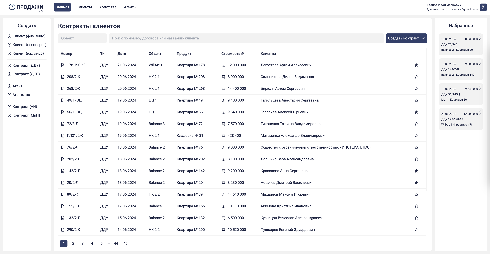
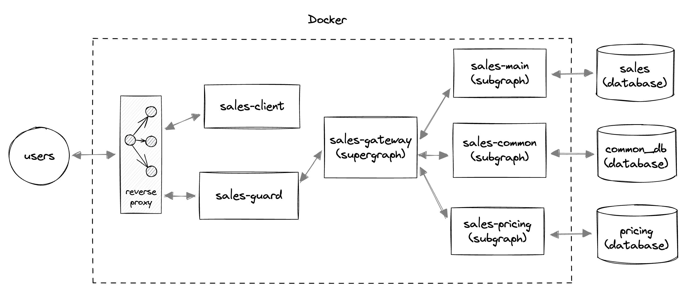

# SALES

**CRM-система по учету продаж в строительной компании.**

- Frontend: React, Vite, Apollo Client, Zustand, Tailwind CSS, Storybook, Jest
- Backend: Node.js, Express, Apollo GraphQL, Prisma ORM, MySQL
- Deployment: Docker, Docker Compose, NGINX
- Repository: Monorepository, NPM, Lerna, GitHub

**ВИДЕО: https://disk.yandex.ru/i/bAybj4y_u0soJA**

## Архитектура

- reverse proxy - swag (https://github.com/linuxserver/docker-swag)
- sales-client - client (react, nginx)
- sales-guard - authorization (express)
- sales-gateway - supergraph, api endpoint (apollo server, apollo gateway)
- sales-main - subgraph (apollo server)
- sales-common - subgraph (apollo server)
- sales-pricing - subgraph (apollo server)
